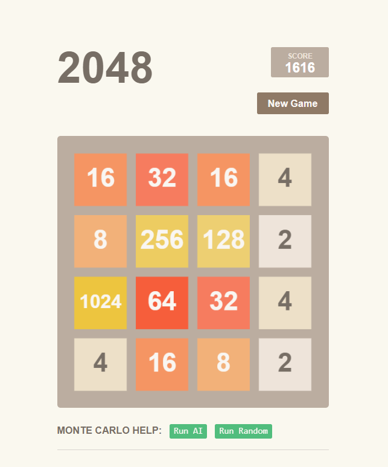

# Monte Carlo 2048 Game!
## Description
This is a 2048 game implemented with Javascript, with the auxiliary AI based on Monte Carlo Tree Search(MCTS) algorithm. This project is greatly inspired by [Jupiter](https://github.com/xtrp/jupiter).

## Acknowledge
- [Jupiter](https://github.com/xtrp/jupiter) for inspiration.
- [2048 Online Game](https://play2048.co/) for building the frontend.
- [JS Touch-Swipe Detect Event](https://stackoverflow.com/a/17567696/13260317) for making this app be able to run on mobile devices.
## Contributing
Admittedly, there are still many errors, bugs or bad logic here. And there lacks animation during transition! I am not a professor in making web game with JavaScript, so you are welcome to point out any flaw or make any improment!
## License & Credits
This project is licensed under the MIT License. Please refer to LICENSE for more information.